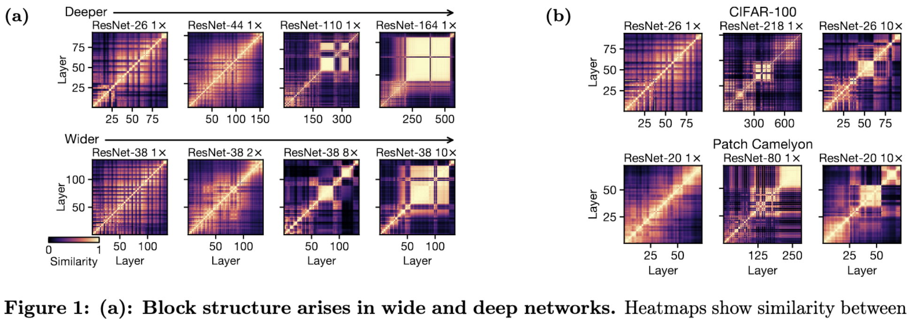

# 2022-3

### 2022-2-20:

[**Fantastic Generalization Measures and Where to Find Them**](https://arxiv.org/abs/1912.02178)**.** Sec4 summarizes results, which seem to all be on CIFAR10 or SVHN. Confirms that overparameterization helps generalization, that norm-based and classical VC-style measures correlate negatively with generalization, and that flatness (and proxies like final gradient variance) also correlate with generalization. Also, faster initial loss reduction correlated with worse generalization, supporting the explore/exploit model of optimization we’ve seen with cyclic learning rates. **I suspect we could lift a bunch of these generalization measures as features to predict final accuracy when training models for people.**

[On the Origins of the Block Structure Phenomenon in Neural Network Representations](https://arxiv.org/pdf/2202.07184.pdf) Maithra looks at why neural nets end up with these block structured activation correlations:

Basically a bunch of datapoints with similar image statistics (like background color) have huge activation magnitudes. If you regularize the first principle component of the activations, or do other stuff like shake-shake regularization, you can make the block structure go away without hurting accuracy.

[Deep Ensembles Work, But Are They Necessary?](https://arxiv.org/pdf/2202.06985.pdf) Yes, ensembling can get you an accuracy lift, but they’re not any more robust, good for quantifying uncertainty, or anything like that.

[A Survey on Model Compression for Natural Language Processing](https://arxiv.org/pdf/2202.07105.pdf) Pretty generic survey covering factorization, quantization, pruning, distillation. I never cease to be amazed by the number of meanings people assign to “Lottery Ticket Hypothesis.” I found the survey of knowledge distillation kind of informative, since personally I haven’t looked at that literature much.

[An Introduction to Neural Data Compression](https://arxiv.org/pdf/2202.06533.pdf) Really good tutorial covering a lot of stuff. I got some dense learning out of these despite already having a strong compression background, which I consider high praise. Not a problem we immediately care about but good firehose to get generic ML experience points from.

[COMPUTE TRENDS ACROSS THREE ERAS OF MACHINE LEARNING](https://arxiv.org/pdf/2202.05924.pdf). Just look at the scatterplot below + summary table. I’m not sure why they split off the red points though; seems pretty weird.

[HOW DO VISION TRANSFORMERS WORK?](https://arxiv.org/pdf/2202.06709.pdf) They argue that 1) multiheaded self-attention (MSA) flattens + smooths the loss landscape, 2) acts as a learnable low-pass filter along the spatial dimensions (like blurpool), and 3) are largely held back by negative hessian eigenvalues (indicating non-convexity), but that these go away if you use enough data or by using GAP at the end instead of a \<CLS> token. They argue that putting MSA at the end of each conv block in a resnet is especially effective. Regarding point (1), they show some results examining the frquency content of MSA and conv layer outputs, as well as how much accuracy goes down when you add in noise of a given frequency; and both suggest that MSA acts as a lowpass filter.

[**Learning the Pareto Front with Hypernetworks**](https://arxiv.org/abs/2010.04104) They want to train a model once and spit out a model at an arbitrary point on the inference speed vs accuracy pareto frontier. They formulate Pareto-Front Learning (PFL), which is maybe a term we should use / try to popularize. “

“Training is applied to preferences sampled from the m−dimensional simplex where m represents the number of objectives.” Input is a minibatch and a preference weighting. Not sure how they quantified loss for runtime. Also, only results on small tasks like fashion-mnist.

[**Characterizing and overcoming the greedy nature of learning in multi-modal deep neural networks**](https://arxiv.org/abs/2202.05306) Some heuristic interventions to try to get the model to learn from all the modalities and not just lean on the most informative modality. Supposedly helps generalization.

[**Investigating Power laws in Deep Representation Learning**](https://arxiv.org/abs/2202.05808) If you compute (X.T @ X) for flattened feature representations X (which they incorrectly call the covariance), and look at the distribution of eigenvals, it sometimes looks like a power law. And they argue through a bunch of plots that if this power law has exponent alpha=1, that’s good for generalization. Didn’t read closely but came away pretty skeptical.

[**Learning Fast Samplers for Diffusion Models by Differentiating Through Sample Quality**](https://arxiv.org/abs/2202.05830) Better results in less time by learning the sampler. Apparently lower gains on Tiny ImageNet than cifar10 though, which is a bad sign regarding scalability. Lot of diffusion math background needed to understand what’s really going on here.

[**Predicting Out-of-Distribution Error with the Projection Norm**](https://arxiv.org/abs/2202.05834) Trying to predict performance on a test set given test set inputs but not labels. Proposed metric takes in 1) a pretrained model to be fine-tuned for the test task, and 2) the test inputs. They then give the test set random labels, finetune the whole model, and compare the distance in parameter space between fine-tuned and original. Larger distance → worse generalization (although you have to fit the linear regression for each specific problem—not network though).

[**Efficient Natural Gradient Descent Methods for Large-Scale Optimization Problems**](https://arxiv.org/abs/2202.06236) Nice unification of different variants of regular + natural gradient descent. Need to stare at the math + code more to figure out the exact algorithm, but seems like a nice hammer to keep in our pocket if we ever start thinking seriously about optimization. Start at sec3 on page 13 for method.

* [**Scaling Laws Under the Microscope: Predicting Transformer Performance from Small Scale Experiments**](https://arxiv.org/abs/2202.06387) Super relevant for us, esp @Moin Nadeem . Asking "can scaling laws provide a principled method for developing models at very small scale and extrapolating to larger ones?”. Answer is yes, for some downstream tasks, if you tune hparams. Hparam tuning is done for each downstream task, not for the pretraining. Scaling laws seem to have better fit for downstream tasks that more closely resemble the pretraining task.

[**Deduplicating Training Data Mitigates Privacy Risks in Language Models**](https://arxiv.org/abs/2202.06539) “We first show that the rate at which language models regenerate training sequences is superlinearly related to a sequence's count in the training set. For instance, a sequence that is present 10 times in the training data is on average generated \~1000 times more often than a sequence that is present only once”

* [**Maximizing Communication Efficiency for Large-scale Training via 0/1 Adam**](https://arxiv.org/abs/2202.06009) Good related work re: existing 1-bit adam. Its initial full-precision stage is so heavy that avg bits transmitted over full BERT-Large training is 5.69 bits. This paper reduces it down to 1.03 at iso accuracy wrt full precision by basically eliminating this part. And 0.61 if you relax it to only allreduce like 2/3 of the time. **Seems like a thing we could just use if their code is easy enough to integrate.** They pick the steps on which to do full-precision allreduce based on some heuristics regarding the current gradient variance.

[**SQuant: On-the-Fly Data-Free Quantization via Diagonal Hessian Approximation**](https://arxiv.org/abs/2202.07471) Going to take a bunch of staring at their math + source code to really understand what’s going on, but basically they try an initial quantization solution and then adaptively pick elements to flip the rounding for (ie, rounding up vs down) such that some error constraints are satisfied. Could be really useful for us because it takes <1s to quantize a whole resnet50, needs to data so it’s easy to run post-training, and seemingly causes no accuracy loss (e.g., 77.7% top1 for 8-bit ResNet50 on ImageNet). So if we can get [their code](https://github.com/clevercool/SQuant/tree/f97cd27e223720c800695276d92797b05d16b967) working, **we might be able to auto-quantize models for users at the end of training, or even transparently quantize saved checkpoints.** If it really is reliably iso-accuracy.

^ Above three terms are: sum of squared rounding errors, sum of (total rounding error in a row(?)), squared total rounding error. So rather than just making all the rounding errors individually small, also make them tend to sum to 0 when reduced across various subsets of axes.

[**Quantifying Memorization Across Neural Language Models**](https://arxiv.org/abs/2202.07646) “We describe three log-linear relationships that quantify the degree to which LMs emit memorized training data. Memorization significantly grows as we increase (1) the capacity of a model, (2) the number of times an example has been duplicated, and (3) the number of tokens of context used to prompt the model.” Although different results across model families.

[**General-purpose, long-context autoregressive modeling with Perceiver AR**](https://arxiv.org/abs/2202.07765)**.** I couldn’t really find any new ideas here relative to the other perceiver papers. They just have a fixed number of queries at the input layer instead of one per input token, so it ends up basically being a linear attention mechanism. But they don’t benchmark on long-range arena or control for compute or model size in any way AFAICT, so couldn’t really find anything to conclude from this.

[**General Cyclical Training of Neural Networks**](https://arxiv.org/abs/2202.08835) Proposes cyclic weight decay, softmax temp, and other cyclic everything basically, mostly on CIFAR but sometimes in imagenet. By the same dude who wrote the superconvergence paper. Tiny effect size; basically seems an instance of the principle that you can add an arbitrary hparam, tune it on the test set, and get apparently better results.

[**Where Is My Training Bottleneck? Hidden Trade-Offs in Deep Learning Preprocessing Pipelines**](https://arxiv.org/abs/2202.08679) Propose to intelligently choose to cache preproc steps vs recompute them at each time step based on profiling. Their code sadly isn’t available on the author’s github, but it appears they meant for it to be. They also profiled a bunch of workloads:

“Application-level caching improved the throughput compared to system-level caching by a factor of 1.3-4.6×, and should be preferred as the deserialization of cached files can slow down the pipeline”. Plus they confirm 10x gains in certain cases, which is unsurprising given that one can be arbitrarily dataloader-bottlenecked.

Main conclusion is that we should go back and stare at their figures in more detail if/when we start doing serious system-level data loading optimization.

[**Transformer Memory as a Differentiable Search Index**](https://arxiv.org/abs/2202.06991) Addresses info retrieval task of mapping text queries to document ids. Instead of having any retrieval step, they train a model to directly spit out docids as strings, treating it as a seq2seq problem. They have it spit out topk indices using the beam search tree in the decoder. They do hierarchical clustering to try to get the similar documents to have similar identifiers; the cluster are just k-means on a embeddings from a small BERT model. They jointly train the model to spit out the docids associated with a given string (indexing) and the topk documents for a given string (retrieval); more data + noiseless supervision for former, but latter is the task they care about. Initialize their model as a pretrained T5. Seems to beat BM25, but it’s also way more expensive AFAICT. Super interesting though; not a lot of papers that are doing something this qualitatively new.

### 2022-2-27:

[**Mixture-of-Experts with Expert Choice Routing**](https://arxiv.org/abs/2202.09368) Instead of choosing the top-k experts for each token, you choose the top-k tokens per expert. Seems to work even better. I actually started coding independently this last month (scooped!), and the subtleties are: 1) it makes your routing function super cheap, which is great, but 2) you end up summing different numbers of activation tensors for each token, which is hard to make efficient. You can `embedding_bag` this, but even constructing the indices is a pain.

[**Designing Effective Sparse Expert Models**](https://arxiv.org/abs/2202.08906) Use top-2 routing, penalize squared l2 norm of logits in routing functions, don’t get rid of multiplicative interactions like RMSNorm and GEGELU (removing them fixes frequent training divergence, but also hurts quality). MoE models do worse downstream because they overfit; try finetuning with a smaller batch size and higher learning rate, and maybe finetuning only a subset of the params (and make sure it’s not only the MoE params, because that sucks). Also observed that larger capacity factors always yield higher quality (at least pretraining). Also multiplying by a learned bias (instead of adding) in the GEGELU after the first linear in the FFN helps. Bunch of negative results in the final appendix, though I didn’t think any were that interesting.

[**Benchmarking the Linear Algebra Awareness of TensorFlow and PyTorch**](https://arxiv.org/abs/2202.09888) PyTorch and TF aren’t as smart as Eigen or other libs that exploit associativity + distributivity in sequences of linear algebra ops. They especially fail at loop hoisting, common-subexpression elimination, and not computing unnecessary stuff when you only need slices of the result. Unclear how often this matters; they don’t have a benchmark of workloads or anything, just microbenchmarks highlighting failure cases.

[\mathcal{Y}\*\*-Tuning: An Efficient Tuning Paradigm for Large-Scale Pre-Trained Models via Label Representation Learning](https://arxiv.org/abs/2202.09817)\*\* Trying to finetune large language models better. I found this pretty hard to make sense of, but they seem to be feeding in learnable representations of each level as input tokens, then jointly attending to those and the input representation from a frozen model, and then just argmax-ing across final label token representations to get a prediction. For some reason they train it with triplet loss. Results look like an improvement in accuracy compared to alternatives, and they have the nice property that they can just run inference through the pretrained model once in the first epoch, and reuse the outputs.

[**ProxSkip: Yes! Local Gradient Steps Provably Lead to Communication Acceleration! Finally!**](https://arxiv.org/abs/2202.09357) New SGD variant for federated learning (and distributed optimization with expensive communication more generally). Basically like FedAvg, which averages weights instead of gradients, but 1) only communicates with some prob p < 1, and 2) shrinks weights towards the last global avg at each step, instead of having them “jump” straight there. Can probably derandomize this for better performance empirically, at the cost of the nice provable convergence rate. I see federated optimization as likely to _eventually_ be relevant for us in that super large-scale training starts hitting the same communication bottlenecks.

[**DataMUX: Data Multiplexing for Neural Networks**](https://arxiv.org/abs/2202.09318) Extreme Mixup used as a speedup technique. Combine a bunch of inputs into one input (of the same size), and then add a module at the end that untangles them and makes a prediction for each one. Input multiplexer is just random projection + elemwise averaging, after doubling the feature space. Can demultiplex N inputs by feeding in a learned query that tells the demux which input to construct the final embedding for. I get the sense they’re either not thinking through what’s happening in the mux or not describing it well, because they talk about appending a position-specific token to each input before the mux, but since they’re applying a linear transform and then averaging all the representations, this is equivalent to just doubling the input space and adding in a fixed bias. Also, they have to pretrain it with an input reconstruction task to get the demux to work. Hard to assess speed vs quality tradeoff here because they report 10-20x speedups, but also huge 2-8% accuracy drops. But pretty interesting that they got this to work at all.

[**When, Why, and Which Pretrained GANs Are Useful?**](https://arxiv.org/abs/2202.08937) “initializing \[with] a pretrained checkpoint primarily affects the model's coverage rather than the fidelity of individual samples”; and “we describe a simple recipe to choose an appropriate GAN checkpoint that is the most suitable for finetuning to a particular target task.” Should usually use an ImageNet-pretrained GAN.

[**Cyclical Focal Loss**](https://arxiv.org/abs/2202.08978) Another cyclic-something paper by the superconvergence guy. Proposes to generalize focal loss, which upweights loss from low-confidence predictions, to instead focus on high-confidence predictions at start and end of training, and low-confidence ones in the middle. Sorta maybe better results on some small experiments, but simple enough to code that it might be worth trying. Also uses the [https://github.com/zhmiao/OpenLongTailRecognition-OLTR](https://github.com/zhmiao/OpenLongTailRecognition-OLTR) variants of imagenet and places, which could be interesting benchmarks to use at some point if customers have heavily imbalanced datasets.

[**Survey on Large Scale Neural Network Training**](https://arxiv.org/abs/2202.10435) Big detailed survey paper of distributed training schemes. Lots of tables distilling differences between approaches. No overall takeaway, but a good reference for ramping up on this area.

[**Enabling On-Device Smartphone GPU based Training: Lessons Learned**](https://arxiv.org/abs/2202.10100) Apparently snapdragon GPUs have garbage memory bandwidth, to the point that training on the mobile CPU is faster. Data movement on snapdragon GPU takes up to 91% of the time. They wrote a bunch of custom kernels that got them to \~50 GFLOPs with GPU vs \~25 with CPU, which might be useful ballpark numbers to keep in mind when reasoning about mobile inference.

[**Deconstructing Distributions: A Pointwise Framework of Learning**](https://arxiv.org/abs/2202.09931) They study the predictions on individual points as a function of various aspects of the predictor, most notably its overall accuracy. Besides the unsurprising finding that samples vary in difficulty, they find that some points are consistently negatively correlated with overall accuracy. I.e., less accurate or partially-trained models are more likely to get them right. This flies in the face of most statistical learning theory under standard assumptions. They also put forth the idea of models learning specific “skills”, like examining global shape rather than local texture; e.g., recognizing a coffee cup (global shape) that has a picture of a dalmation on it (striking but misleading texture). Main takeaway is that **storing metadata about specific samples over time can yield useful insights**; and there might be some set of domain-specific “skills” we could identify and use to help customers understand their models better.

[**Loss as the Inconsistency of a Probabilistic Dependency Graph: Choose Your Model, Not Your Loss Function**](https://arxiv.org/abs/2202.11862) Interesting but esoteric stuff I’d like to spend 20 hours ramping up on, but probably never will. Mostly listing this because this dude has the best latex skills I’ve ever seen and I want to copy-paste his macros into all my future papers.

[**A New Generation of Perspective API: Efficient Multilingual Character-level Transformers**](https://arxiv.org/abs/2202.11176) Google deployed a multi-lingual character-level transformer for toxic comment classification. Written by the charformer people, which was a paper that added a learnable tokenizer. (Learnable tokenizer was complicated and didn’t seem to have a unifying idea, so I don’t fully understand it). Makes intuitive sense that operating on UTF8 bytes makes a ton of sense for sharing a model across languages, handling intra-message language switching, and dealing with emoji well. Mostly suggests that we might be able to get rid of tokenizers and simplify language model APIs.

[**First is Better Than Last for Training Data Influence**](https://arxiv.org/abs/2202.11844) Presents evidence that, when assessing the influence of specific training samples on model parameters, you should focus on gradients of the word embeddings, rather than gradients for the output layer.

[**Learning to Merge Tokens in Vision Transformers**](https://arxiv.org/abs/2202.12015) Halfway through the (encoder) network, they reduce the number of patches to 8 using 8 learned query vectors, similar to the Perceiver. It’s always 8, even if eval is with higher-res images. 2x FLOP reduction, and 1.6x speedup, as evaluated on JFT300M and when fine-tuned for 10-shot ImageNet-1k.

[**Auto-scaling Vision Transformers without Training**](https://arxiv.org/abs/2202.11921) They come up with a ViT design and scaling strategy based on features extracted from 87 offline ImageNet training runs, rather than based on interactively training each architecture their policy wants to try. The main feature they use is derived from feeding in a particular input that traces out a 2d unit circle in high-dimensional space, and looking at how much the length changes at the output (I have no idea how they chose this input generation function, or arrived at the three features they chose to evaluate). They also use the NTK condition number as a feature (ratio of largest and smallest eigenvals of NTK matrix). So basically they have this accuracy proxy they can compute for a given model that’s _way_ cheaper than running the training. The auto-scaling uses the best small architecture they could find, and then increases the width and depth based on the same proxy. They run their full NAS search in 7 V100-hours. They also propose to use progressive resizing during training, but it basically doesn’t work (-1% ImageNet acc at 2x time reduction) despite them seemingly tuning the schedule. Overall, **I see this as an encouraging result regarding the efficacy of learning from multiple runs,** and the value of collecting a bunch of weird features about networks that might prove predictive.

[**Transformer Quality in Linear Time**](https://arxiv.org/abs/2202.10447)

The part that isn’t captured in the above is they also use a linear attention variant that lets them do autogregressive training much more quickly. It’s quadratic within non-overlapping sequence chunks of a fixed size, so you can update the attention state in constant time as you move down the sequence, but it doesn’t suck. Transformer+ = Vanilla transformer + RoPE. Transformer++ = Vanilla transformer + RoPE + GLU. “all models are implemented in the same codebase to ensure identical tokenizer and hyper-parameters for training and evaluation.”

### 2022-3-6:

[**Parameter-Efficient Mixture-of-Experts Architecture for Pre-trained Language Models**](https://arxiv.org/abs/2203.01104) Factorize the experts and reuse the biggest matrix in the factorization across all the experts. Maybe outperforms switch transformer-style MoE when grafted onto GPT-2? At the operating point, about 1.25x more params overall, whereas switch-like baseline was 4.67x. Seems to do better than regular MoE on WikiText-2 perplexity:

[**HyperPrompt: Prompt-based Task-Conditioning of Transformers**](https://arxiv.org/abs/2203.00759) Goal is to do better than vanilla finetuning for LLMs. They 1) still do finetuning on the whole model, but also 2) add extra task-specific Keys and Values to all the self-attention layers. Since the number of queries is still equal to the number of tokens, you can just do this and the model works fine. They generate the keys and values for each module using a hypernetwork that takes in where the module is and what the task is. It’s only this hypernetwork that has its prompts tuned, not the original network (AFAICT). Minimal inference-time param cost, but no latency vs accuracy numbers. Seems to work as measured by param count:

[**Do Transformers use variable binding?**](https://arxiv.org/abs/2203.00162) You might hope that transformers can learn abstract rules, and then apply them to particular inputs, logic program style. But doesn’t look like they do, as measured in some careful experiments where they would do great iff they developed this ability. Specifically, if you keep the structure of the task the same (e.g., sequence reversal) but swap the vocabulary at test time, transformers completely fail.

[**Dynamic N:M Fine-grained Structured Sparse Attention Mechanism**](https://arxiv.org/abs/2203.00091) They add ampere sparsity into the self-attention kernels at runtime (can’t do it statically since attention mat not known ahead of time) and get 1.25-1.9x speedups at iso accuracy. Seems to compose pretty well with fast attention variants, although requires some thought in each case (and maybe unreported trial and error?). Works because they wrote CUDA kernels that fuse the pruning into the GEMM kernel that produces the attention matrix. They don’t quite have pareto frontiers, but it seems basically just as accurate and faster. **We might be able to just use their library to get faster attention.** Also strengthens my conviction that **we should be exploiting ampere sparsity.**

[**Resolving label uncertainty with implicit posterior models**](https://arxiv.org/abs/2202.14000) Trying to get models to work better with crappy or insufficient labels. E.g., can you do classification when you only know for sure a few classes that each image _isn’t_. They learn a sample-specific prior over labels, and have a couple modified cross-entropy-like losses (there are two because of KL(p||q) vs KL(q||p)). Need to stare at the math and/or code for longer, but seems like there’s a clever idea here that might let us get self-distillation or self-label smoothing working really well.

[**BagPipe: Accelerating Deep Recommendation Model Training**](https://arxiv.org/abs/2202.12429) They do a bunch of analysis of DLRM access patterns and basically build a giant distributed cache with synchronous training semantics. Good profiling\* and probably good systems work, but not relevant until/unless we start caring about DLRM. Interesting cache design because 1) some keys are super hot and, 2) you can read ahead as far as you want within an epoch, so you know the access patterns in advance.

* e.g., found only 8.5% of time spent in fwd-bwd, 1% of embeddings are responsible for 92% of accesses.

[FastFold: Reducing AlphaFold Training Time from 11 Days to 67 Hours](https://arxiv.org/abs/2203.00854) A bunch of people at a Chinese university (not DeepMind itself) sped up alphafold by a lot using systems optimizations. Got 90% strong scaling up to 512 GPUs with a customized model parallelism approach along with good communication interleaving. This is mostly interesting on a strategic level, because, basically, AlphaFold is weird. It has these highly custom blocks baking in structural priors, and it also runs its own output back thru 4 times (1-4 times at random during training). I don’t understand the details, but this points to the **existence of a long tail of well-tuned, domain-specific architectures we don’t hear about in mainstream ML literature.** I.e., contraindicates “one model to rule them all”.

[**Standard Deviation-Based Quantization for Deep Neural Networks**](https://arxiv.org/abs/2202.12422) Bag of heuristics to get to 76.4% ResNet-50 on I1k accuracy at test time, and with constraint that weights are all either 0 or a small power of 2. They talk about how setting their learned clip threshold as a number of standard deviations helps, how gradually reducing the bitwidth while keeping the thresholds constant helps (so that the dynamic range just gets halved), and how shrinking the gradients wrt their clip threshold (effectively increasing the weight decay on it) helps. I get the sense it’s mostly just that they have this trainable threshold with a ton of weight decay.

I’m skeptical of all these papers’ claims of “improvement” because the literature seems too saturated to maintain a total order, but the absolute numbers here are enough to bolster my belief that iso accuracy 4-bit logarithmic quantization by the end of training is possible (since we’ve seen this in a couple other papers). Which in turn suggests that 8-bit partway thru training and/or in part of the network is reasonably promising.

[**Rethinking the Role of Demonstrations: What Makes In-Context Learning Work?**](https://arxiv.org/abs/2202.12837) “randomly replacing labels in the \[fine-tuning] barely hurts performance, consistently over 12 different models including GPT-3. Instead, we find that other aspects of the demonstrations are the key drivers of end task performance, including the fact that they provide a few examples of (1) the label space, (2) the distribution of the input text, and (3) the overall format of the sequence.” I’m not sure what to take away from this concretely, but it seems like important data about what’s really going on in fine tuning.

[**When Shift Operation Meets Vision Transformer: An Extremely Simple Alternative to Attention Mechanism**](https://arxiv.org/abs/2201.10801)

They replace the attention mechanism in a Swin transformer with a simple spatial shift of some of the channels. Works just as well, essentially, as measured in accuracy, flops, params, and time. Although their times are inference on a GTX1080-Ti, which doesn’t have tensor cores, and therefore probably makes their bandwidth-bound ops look better. They argue that this suggests that attention isn’t that important to ViT accuracies, and instead it’s more from AdamW, GELU, and training for 300 epochs (see nice ablations table below).

[**DeepNet: Scaling Transformers to 1,000 Layers**](https://arxiv.org/abs/2203.00555)

